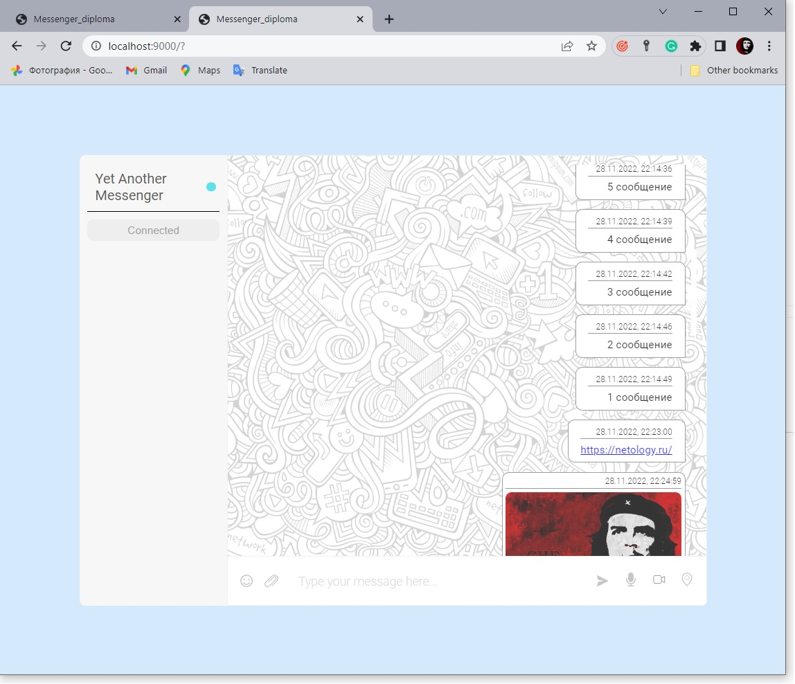
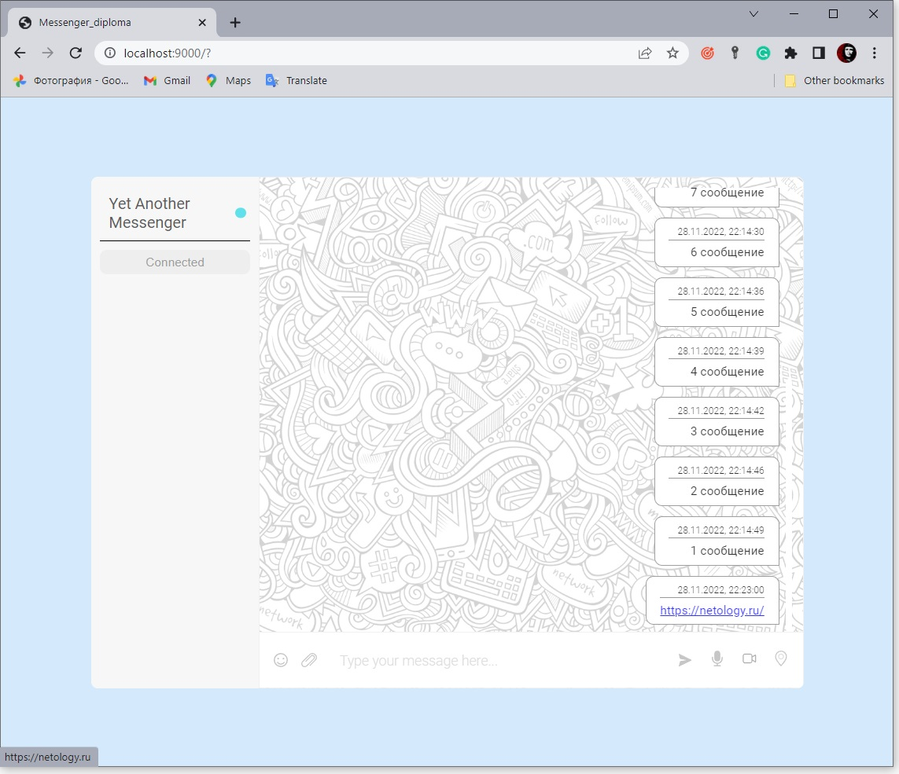
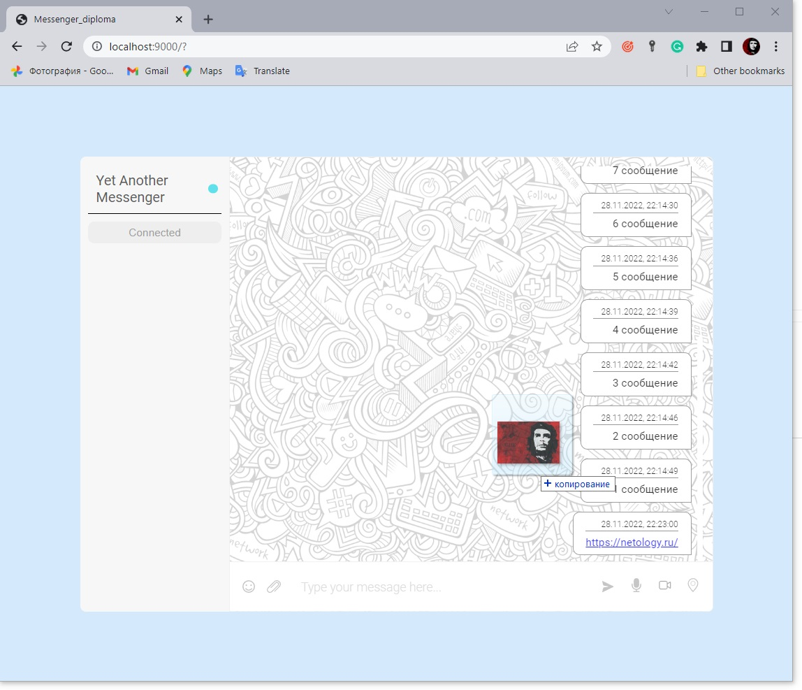
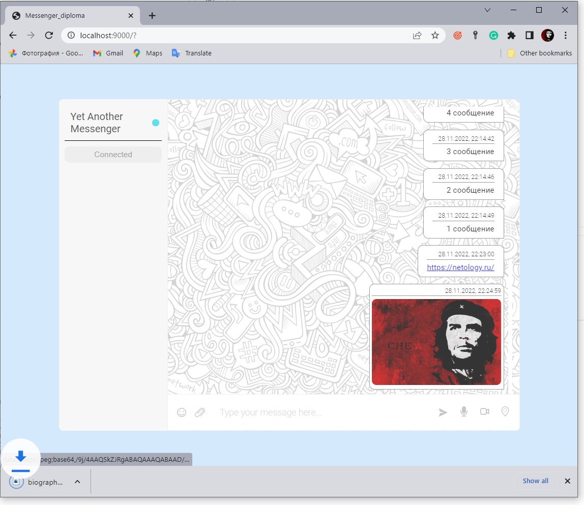
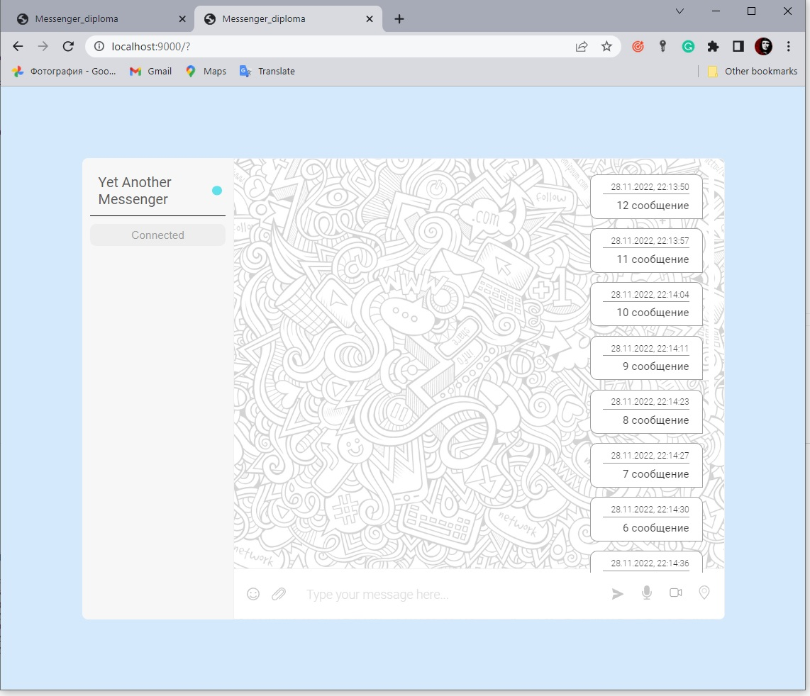
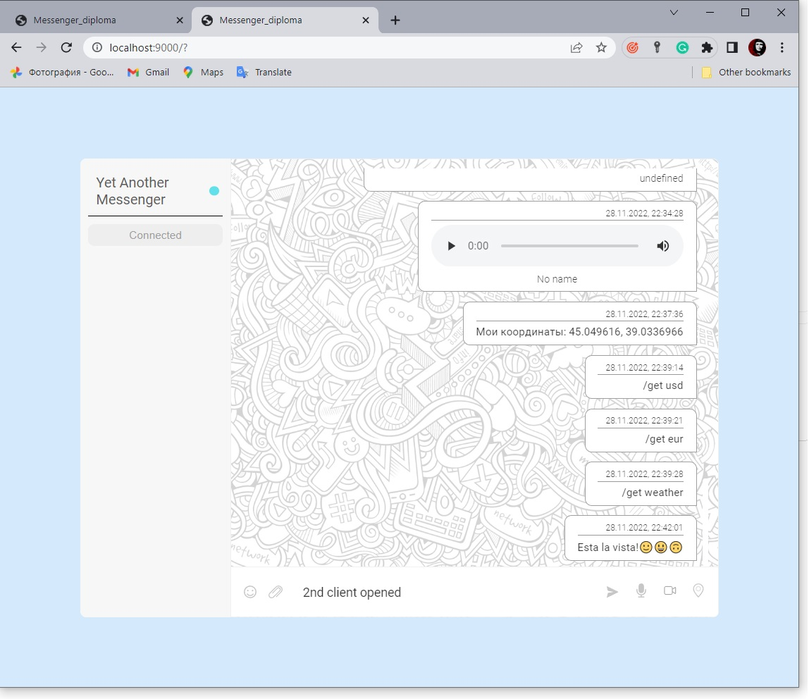
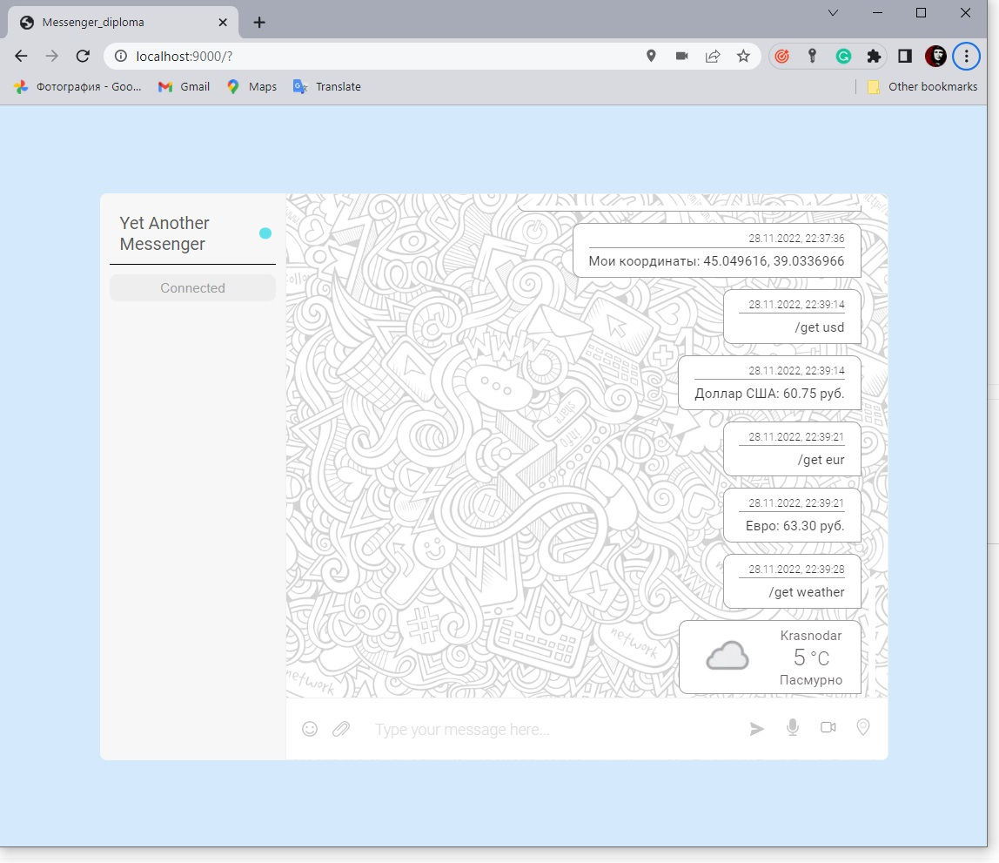
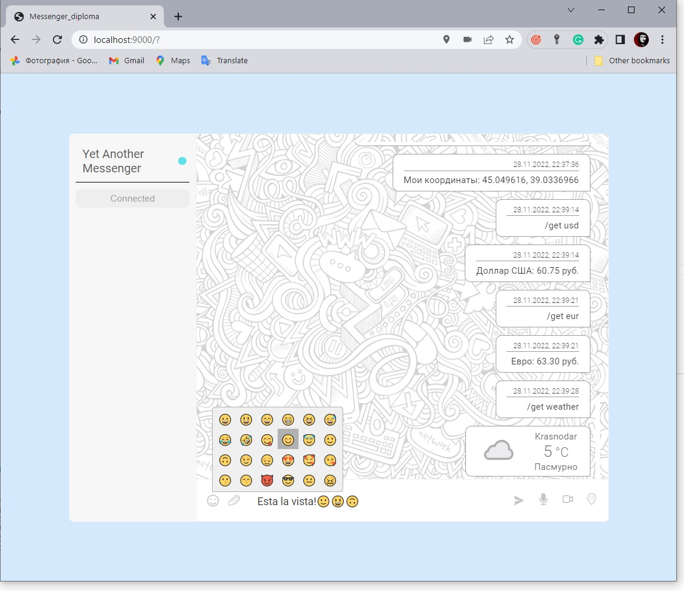

# AHJ Diploma

## Описание проекта

### Реализованы обязательные функции:

* сохранение в истории ссылок и текстовых сообщений;

* ссылки (`http://` или `https://`) должны быть кликабельны и отображаться, как ссылки;

* сохранение в истории изображений, видео и аудио (как файлов) — через Drag & Drop и через иконку загрузки;

* скачивание файлов на компьютер пользователя;

* ленивая подгрузка: сначала подгружаются последние 10 сообщений, при прокрутке вверх подгружаются следующие 10 и т. д.

### Реализованы дополнительные функции:

* синхронизация: если приложение открыто в нескольких окнах или вкладках, то контент должен быть синхронизирован;

* запись и воспроизведение видео и аудио, используя API браузера;

* отправка геолокации по клику на кнопку в поле ввода;

* отправка команд боту:
  - '/get usd' бот присылает действующий курс Доллара к Рублю;
  - '/get eur' бот присылает действующий курс Евро к Рублю;
  - '/get weather' бот присылает прогнозом погоды по координатам клиента;

* поддержка смайликов (emoji).
